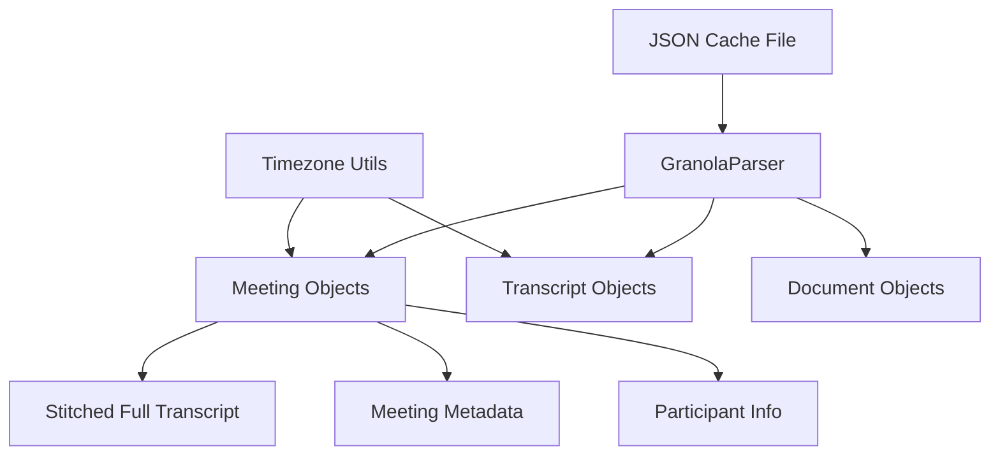
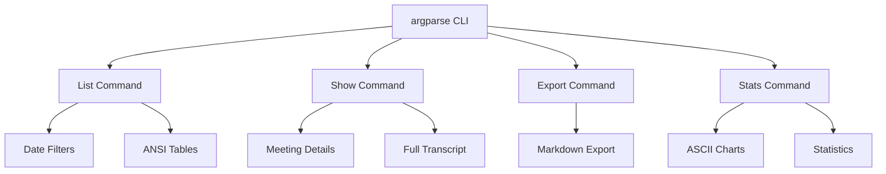
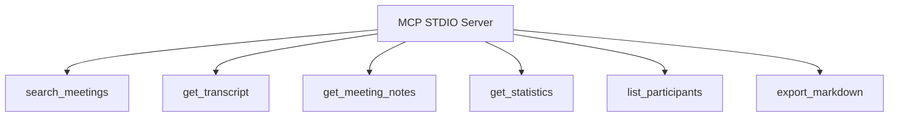

# GranolaMCP Architecture Plan

## Project Overview

A Python 3.12+ library providing programmatic, CLI, and MCP access to Granola.ai meeting data with live JSON parsing, beautiful terminal output, and comprehensive meeting management capabilities. **100% Native Python - No External Dependencies**.

### Data Access Strategy

**GranolaMCP uses a cache-based approach exclusively** - all data is read directly from Granola's local cache file (`cache-v3.json`) without any network communication. This design choice provides:

- **Offline Operation**: Complete functionality without internet connectivity
- **Performance**: Direct file system access eliminates API latency
- **Privacy**: Meeting data remains on the local machine
- **Reliability**: No dependency on Granola's server availability

**Note**: While it would be technically feasible to implement API-based access by extracting authentication tokens from Granola's `supabase.json` configuration, this library intentionally focuses on the cache-based approach for optimal user experience.

## Project Structure

```
GranolaMCP/
├── granola_mcp/
│   ├── __init__.py
│   ├── core/
│   │   ├── __init__.py
│   │   ├── parser.py          # JSON parsing and data models
│   │   ├── meeting.py         # Meeting data class with transcript stitching
│   │   ├── transcript.py      # Transcript processing and formatting
│   │   └── timezone_utils.py  # UTC to CST conversion utilities
│   ├── cli/
│   │   ├── __init__.py
│   │   ├── main.py           # argparse CLI entry point
│   │   ├── commands/
│   │   │   ├── __init__.py
│   │   │   ├── list.py       # List meetings with filters
│   │   │   ├── show.py       # Show meeting details
│   │   │   ├── export.py     # Export meeting to markdown
│   │   │   └── stats.py      # Statistics and visualizations
│   │   └── formatters/
│   │       ├── __init__.py
│   │       ├── table.py      # ANSI table formatting
│   │       ├── markdown.py   # Markdown export formatting
│   │       ├── charts.py     # ASCII chart generation
│   │       └── colors.py     # ANSI color utilities
│   ├── mcp/
│   │   ├── __init__.py
│   │   ├── server.py         # MCP STDIO server implementation
│   │   └── tools.py          # MCP tool definitions
│   └── utils/
│       ├── __init__.py
│       ├── config.py         # Configuration and .env handling
│       └── date_parser.py    # Native relative/absolute date parsing
├── tests/
│   ├── __init__.py
│   ├── test_parser.py
│   ├── test_meeting.py
│   ├── test_cli.py
│   └── test_mcp.py
├── docs/
│   ├── README-JSON.md        # Detailed JSON structure documentation
│   ├── CLI-USAGE.md         # CLI usage examples
│   └── MCP-INTERFACE.md     # MCP interface documentation
├── setup.py
├── .env.example
├── .gitignore
├── LICENSE
└── README.md
```

## Core Architecture Components

### 1. Data Models & Parsing (`core/`)



**Key Classes:**
- `GranolaParser`: Main parser for the JSON cache file (using `json` module)
- `Meeting`: Rich meeting object with stitched transcript, notes, metadata
- `Transcript`: Individual transcript segments with speaker identification
- `TimezoneConverter`: UTC to CST conversion using `datetime` and `zoneinfo`

**Features:**
- Live JSON parsing (no caching)
- Automatic transcript stitching from segments
- Timezone conversion (UTC → CST) using Python 3.9+ `zoneinfo`
- Rich meeting metadata extraction

### 2. CLI Interface (`cli/`)



**CLI Commands (using argparse):**
```bash
# List meetings with various filters
python -m granola_mcp list --last 3d                    # Last 3 days
python -m granola_mcp list --last 24h                   # Last 24 hours
python -m granola_mcp list --last 1w                    # Last 1 week
python -m granola_mcp list --from 2025-01-01            # From specific date
python -m granola_mcp list --from 2025-01-01 --to 2025-01-31  # Date range

# Show meeting details
python -m granola_mcp show <meeting-id>                  # Full meeting details
python -m granola_mcp show <meeting-id> --transcript     # Just transcript
python -m granola_mcp show <meeting-id> --notes          # Just notes

# Export to markdown
python -m granola_mcp export <meeting-id>                # Export to stdout
python -m granola_mcp export <meeting-id> > meeting.md   # Export to file

# Statistics and visualizations
python -m granola_mcp stats --meetings-per-day --last 30d
python -m granola_mcp stats --duration-distribution
python -m granola_mcp stats --participant-frequency
```

### 3. Native Python Components

**ANSI Color Support (`formatters/colors.py`):**
```python
# ANSI escape codes for terminal colors
RED = '\033[91m'
GREEN = '\033[92m'
YELLOW = '\033[93m'
BLUE = '\033[94m'
MAGENTA = '\033[95m'
CYAN = '\033[96m'
WHITE = '\033[97m'
RESET = '\033[0m'
BOLD = '\033[1m'
```

**ASCII Charts (`formatters/charts.py`):**
- Bar charts using Unicode characters
- Line graphs with ASCII art
- Simple histogram generation
- Meeting frequency visualization

**Date Parsing (`utils/date_parser.py`):**
```python
# Native Python relative date parsing
def parse_relative_date(date_str):
    """Parse '3d', '24h', '1w' format using datetime"""
    # Implementation using datetime.timedelta

def parse_absolute_date(date_str):
    """Parse 'YYYY-MM-DD' format using datetime.strptime"""
    # Implementation using datetime.strptime
```

**Configuration (`utils/config.py`):**
```python
# Simple .env file parsing without external dependencies
def load_env_file(path='.env'):
    """Parse .env file manually"""
    # Simple key=value parsing
```

### 4. MCP Interface (`mcp/`)



**MCP Tools (Native Python JSON-RPC):**
- `search_meetings`: Search by date, title, participants, content
- `get_transcript`: Get full stitched transcript for a meeting
- `get_meeting_notes`: Get structured notes and metadata
- `get_statistics`: Generate meeting statistics and insights
- `list_participants`: List all participants across meetings
- `export_markdown`: Export meeting in markdown format

### 5. Technical Implementation Details

**JSON Parsing Strategy:**
```python
import json
from pathlib import Path

class GranolaParser:
    def __init__(self, cache_path):
        self.cache_path = Path(cache_path)

    def load_cache(self):
        """Load and parse JSON cache file"""
        with open(self.cache_path, 'r') as f:
            data = json.load(f)
        return json.loads(data['cache'])
```

**Timezone Conversion (Python 3.9+):**
```python
from datetime import datetime
from zoneinfo import ZoneInfo

def utc_to_cst(utc_timestamp):
    """Convert UTC timestamp to CST"""
    utc_dt = datetime.fromisoformat(utc_timestamp.replace('Z', '+00:00'))
    cst_dt = utc_dt.astimezone(ZoneInfo('America/Chicago'))
    return cst_dt
```

**Transcript Stitching Algorithm:**
```python
def stitch_transcript(transcript_segments):
    """Combine transcript segments into coherent text"""
    # Sort by timestamp
    # Group by speaker/source
    # Combine consecutive segments
    # Return formatted full transcript
```

## Key Features

### 1. Zero Dependencies
- Uses only Python standard library
- Compatible with Python 3.12+
- No external package installations required

### 2. Live JSON Parsing
- Always reads from live Granola cache file
- Efficient parsing with lazy loading
- No local database or caching layer

### 3. Native Terminal Output
- ANSI escape codes for colors and formatting
- Unicode characters for charts and tables
- Cross-platform terminal compatibility

### 4. Flexible Date Parsing
- Custom implementation for relative dates (`3d`, `24h`, `1w`)
- Standard `datetime.strptime` for absolute dates
- Timezone-aware date handling

### 5. ASCII Visualization
- Bar charts for meeting frequency
- Simple line graphs for trends
- Histogram for duration distribution
- All rendered in terminal with ASCII/Unicode

## Implementation Phases

### Phase 1: Core Foundation
1. JSON parser using standard `json` module
2. Basic Meeting and Transcript classes
3. Native timezone conversion with `zoneinfo`
4. Simple .env file parsing

### Phase 2: CLI Interface
1. argparse-based CLI structure
2. ANSI color and formatting utilities
3. List and show commands
4. Custom date filtering logic

### Phase 3: Advanced Features
1. Transcript stitching algorithm
2. Statistics generation
3. ASCII chart implementation
4. Markdown export functionality

### Phase 4: MCP Integration
1. Native JSON-RPC STDIO server
2. MCP tool definitions and handlers
3. Integration testing
4. Comprehensive documentation

## File Dependencies

**No external dependencies required!**

All functionality implemented using Python 3.12+ standard library:
- `json` - JSON parsing
- `datetime` + `zoneinfo` - Date/time handling
- `argparse` - CLI interface
- `pathlib` - File path handling
- `sys`, `os` - System interaction
- `re` - Regular expressions
- `collections` - Data structures
- `typing` - Type hints

## Benefits of Native Python Approach

1. **Zero Installation Friction**: No pip installs required
2. **Lightweight**: Minimal memory footprint
3. **Fast Startup**: No dependency loading overhead
4. **Portable**: Works anywhere Python 3.12+ is installed
5. **Maintainable**: No dependency version conflicts
6. **Secure**: No third-party code vulnerabilities

This architecture provides a clean, efficient, and completely self-contained solution for interfacing with Granola.ai meeting data while maintaining professional-grade functionality and user experience.